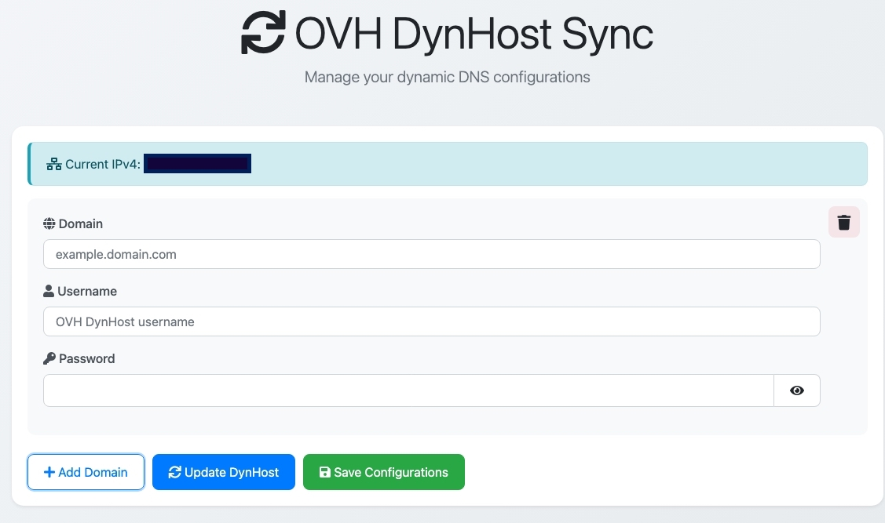

# OVH DynHost Sync

## Introduction

OVH DynHost Sync is a tool that automates the synchronization of your OVH DynHost Domains configurations with your current IPv4 address. It ensures your DNS records are always up-to-date without manual updates.

It supports multiple domains and allows you to configure the update interval. The application fetches your current IP address and updates the DynHost settings accordingly.



## Installation

### Standard Setup

1. Ensure `config.json` exists in the root directory (). If not, create it with the following content:

    ```json
    {
      "domains": [],
      "interval": 5
    }
    ```

2. Configure your domains in the application. Each domain should include the subdomain (e.g., `subdomain.example.com`).
3. Provide the necessary OVH credentials through the web interface.
4. Use the "Save Configurations" button to save your settings without performing an immediate update.
5. The application will automatically update the DynHost configurations at the specified intervals.

### Docker Setup

1. Make sure you have Docker and Docker Compose installed on your system.

2. Create a `config.json` file in the project root directory (see Configuration section below).

3. Start the application using Docker Compose:

    ```bash
    docker-compose up -d
    ```

4. Access the web interface at `http://localhost:3000`

5. The container will automatically restart unless stopped manually. To stop:

    ```bash
    docker-compose down
    ```

## Docker Image

The application is available as a Docker image from GitHub Container Registry. You can run it in several ways:

### Using Docker Run

```bash
# Pull the image
docker pull ghcr.io/alamparelli/ovh-multidomains-dynhost:latest

# Run with config file mounted
docker run -d \
  -p 127.0.0.1:3000:3000 \
  -v $(pwd)/config.json:/app/config.json \
  ghcr.io/alamparelli/ovh-multidomains-dynhost:latest
```

### Using Docker Compose

Create a `docker-compose.yml` file:

```yaml
services:
  ovh-sync:
    image: ghcr.io/alamparelli/ovh-multidomains-dynhost:latest
    volumes:
      - ./config.json:/app/config.json
    ports:
      - "127.0.0.1:3000:3000"
    restart: unless-stopped
```

Then run:

```bash
docker-compose up -d
```

Replace `USERNAME` with your GitHub username in all examples.

The web interface will be available at `http://localhost:3000` or to the Ip of your server

## Configuration

The application uses a `config.json` file located in the root directory to store domain configurations and the update interval.

```json
{
  "domains": [
    {
      "subdomain": "subdomain.example.com",
      "username": "your-ovh-username",
      "password": "your-ovh-password"
    }
  ],
  "interval": 5
}
```

- **domains**: An array of domain objects containing:
  - `subdomain`: The subdomain to update (e.g., `subdomain.example.com`).
  - `username`: Your OVH DynHost username.
  - `password`: Your OVH DynHost password.
- **interval**: Time in minutes between each automatic update.

## Usage

- Access the web interface to add or remove domain configurations.
- The application fetches your current IPv4 address and updates the DynHost settings accordingly.
- Configurations are saved to `config.json` and persisted across restarts.
- On page load, the application retrieves saved configurations and populates the form.
- Use the "Update DynHost" button to immediately update DynHost configurations with the current IP.
- Use the "Save Configurations" button to save changes without updating DynHost.

## License

This project is licensed under the MIT License.
